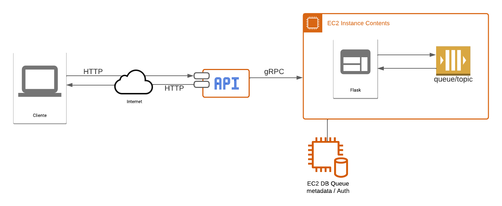

# ST0263 Tópicos Especiales en Telematica

# Estudiantes: 
- Mauricio Escudero, mescude1@eafit.edu.co
- Jose Alejandro Sánchez Sánchez, jasanchez@eafit.edu.co
- Edison Alejandro Torres Muñoz, eatorresm@eafit.edu.co
#
# Profesor: Edwin Nelson Montoya Munera, emontoya@eafit.edu.co

# Proyecto 1
#
# 1. Breve descripción de la actividad
Diseñar e implementar un middleware orientado a mensajes (MOM) que permita a un conjunto de CLIENTES enviar y recibir mensajes de datos.
#
# 1.1. Que aspectos cumplió o desarrolló de la actividad propuesta por el profesor (requerimientos funcionales y no funcionales)

1.  Conexión y desconexión al servidor.
2. Ciclo de vida de tópicos (los canales tienen nombres únicos):
- Crear un tópico
- Borrar un tópico
- Listar los tópicos
3. Ciclo de vida de colas (las colas tienen nombres únicos):
- Crear una cola
- Borrar una cola
- Listar las colas
4. Envío y recepción de un mensaje a un tópico.
5. Envío y recepción de un mensaje a una cola.
6. Memoria compartida.
7. Particionamiento y Transparencia.
8. API REST. 
9. Implementación y despliegue en AWS.

# 1.2. Que aspectos NO cumplió o desarrolló de la actividad propuesta por el profesor (requerimientos funcionales y no funcionales)

Todos los requerimientos obligatorios al igual que algunos opcionales fueron implementados.

# 2. Información general de diseño de alto nivel, arquitectura, patrones, mejores prácticas utilizadas.

El cliente se conecta a través de Internet y realiza peticiones a una API. A su vez, la API se conecta al Flask (ApiGateway) para establecer la comunicación. La comunicación entre el Gateway y el MOM se realiza a través de gRPC. La implementación de colas y tópicos hacen parte del MOM, junto con su respectiva memoria compartida.

# 3. Descripción del ambiente de desarrollo y técnico: lenguaje de programación, librerias, paquetes, etc, con sus numeros de versiones.

El lenguaje que se utilizó fue Python y se realizó una aplicación Flask que se conecta a un servidor donde este recibe los mensajes, los manda a una base de datos local y ya dependiendo de lo que se quiera se puede:

- Crear colas y tópicos.
- Eliminar colas y tópicos.
- Enviar mensajes a la cola o al tópico
- Extraer mensajes de la cola o del tópico
- Listar colas y tópicos desde la base de datos

## El requirements que se utilizó para el Api_Gateway es:

        click==8.1.3
        Flask==2.0.3
        flask-injector==0.13.0
        connexion[swagger-ui]==2.13.1
        dynaconf==3.1.8
        Flask-Login
        Flask-SQLAlchemy
        Flask-WTF==1.1.1
        itsdangerous==2.1.2
        Jinja2==3.0.3
        MarkupSafe==2.1.2
        python-dotenv==1.0.0
        SQLAlchemy==1.4.41
        Werkzeug==2.2.3
        WTForms==3.0.1
        gunicorn==20.1.0
        validators==0.20.0
        email_validator==1.3.1
        grpcio==1.51.3
        protobuf==4.22.0

## El requirements que se utilizó para el Servidor es:

        Flask
        flask-injector==0.13.0
        Flask-WTF==1.1.1
        itsdangerous==2.1.2
        Jinja2==3.0.3
        MarkupSafe==2.1.2
        python-dotenv==1.0.0
        Werkzeug==2.2.3
        WTForms==3.0.1
        gunicorn==20.1.0
        validators==0.20.0
        email_validator==1.3.1
        grpcio==1.51.3
        protobuf==4.22.0
        Flask-SQLAlchemy==3.0.3
        SQLAlchemy~=2.0.9

# 3.1. Como se compila y ejecuta.

## En local:

Se comienza ejecutando el yml con:

        docker-compose up

## Interacción con el Servidor en AWS:

Ingresando al subdomino en el Browser.

# 3.2. Detalles del desarrollo.

# 3.3. Detalles técnicos
El subdominio llama al api_gateway y se ejecuta en plano en una de la maquina virtual de AWS y con la llave generada para el acceso se entrar a la maquina; para asi poder saber que hay dentro de ella.

# 3.4. Descripción y como se configura los parámetros del proyecto (ej: ip, puertos, conexión a bases de datos, variables de ambiente, parámetros, etc)

# 3.5. Detalles de la organización del código por carpetas o descripción de algún archivo. (ESTRUCTURA DE DIRECTORIOS Y ARCHIVOS IMPORTANTE DEL PROYECTO, comando 'tree' de linux)

# 4. Descripción del ambiente de EJECUCIÓN (en producción) lenguaje de programación, librerias, paquetes, etc, con sus numeros de versiones.

# IP o nombres de dominio en nube o en la máquina servidor.

## descripción y como se configura los parámetros del proyecto (ej: ip, puertos, conexión a bases de datos, variables de ambiente, parámetros, etc)

## como se lanza el servidor.

## una mini guia de como un usuario utilizaría el software o la aplicación

## opcionalmente - si quiere mostrar resultados o pantallazos 

# 5. otra información que considere relevante para esta actividad.

# referencias:

- Flask SQLAlchemy Patterns. (s.f.). Recuperado de https://flask-es.readthedocs.io/patterns/sqlalchemy/
- Flask Skeleton. (s.f.). Recuperado de https://github.com/enwawerueli/flask-skeleton/blob/master/flask_skeleton/skeleton/app/__init__.py 
- GitHub - Flask Skeleton. (s.f.). Recuperado de https://github.com/enwawerueli/flask-skeleton
- gRPC - What is gRPC? (s.f.). Recuperado de https://grpc.io/docs/what-is-grpc/introduction/
- Python Documentation - multiprocessing.shared_memory. (s.f.). Recuperado de https://docs.python.org/3/library/multiprocessing.shared_memory.html
